# HN Hiring Scanner

Quickly research **HN "Who's hiring?"** job postings with advanced filtering and side-by-side comparision.

## Features

- Sort/filter by company, location, remote policy, job title, visa sponsorship, ...
- Tech-stack filter with boolean logic support (eg. `Python AND (React OR Angular)`, `C AND NOT C++`)
- Side-by-side job comparison tool with differences/commons highlighted.

```mermaid
flowchart BT
    %% Professional Pastel Color Scheme
    classDef user fill:#FFDFFF,stroke:#AFFBF,stroke-width:4px,color:#333
    classDef action fill:#DFFFEF,stroke:#4F7F3F,stroke-width:2px,color:#333
    classDef benefit fill:#EFFFEF,stroke:#4F9F7F,stroke-width:2px,color:#333
    classDef outcome fill:#FFFFCF,stroke:#FFDF3F,stroke-width:4px,color:#333
    classDef system fill:#CFEFFF,stroke:#4F7FFF,stroke-width:2px,color:#666

    %% Job Seeker Journey (Primary Focus)
    JobSeeker(("👤 **Job Seeker**<br/>Looking for Opportunities")):::user

    subgraph Journey [" Your Job Search Journey "]
        direction BT
        Search["🔍 **Search & Filter**<br/>Find Relevant Positions"]:::action
        Compare["⚖️ **Compare Opportunities**<br/>Side-by-side Analysis"]:::action
        Shortlist["⭐ **Shortlist Best Matches**<br/>Track Favorites"]:::action
        Apply["📧 **Apply Directly**<br/>Contact Employers"]:::action
    end

    Hired{{"🎉 **HIRED!**<br/>Land Your Dream Job"}}:::outcome

    %% Supporting System (Secondary)
    subgraph System [" Behind the Scenes "]
        direction BT
        Source["📰 Hacker News"]:::system
        Pipeline["🛠️ HN Hiring<br/>Scanner Pipeline"]:::system
        DB[("💾 Structured<br/>Job Database")]:::system
        Source -->|Monthly| Pipeline
        Pipeline -->|Populates| DB
    end

    %% Primary User Flow (Bold arrows)
    JobSeeker ==>|1. Visit Platform| Search
    Search ==>|2. Discover| Compare
    Compare ==>|3. Evaluate| Shortlist
    Shortlist ==>|4. Take Action| Apply
    Apply ==>|5. Interview Process| Hired

    %% System Support (Dotted arrows)
    DB -.->|Powers| Search
```

## Contributors

  - 💭 Idea-man https://github.com/hjpotter92
  - 🧹 Software Janitor https://github.com/floatinginbits